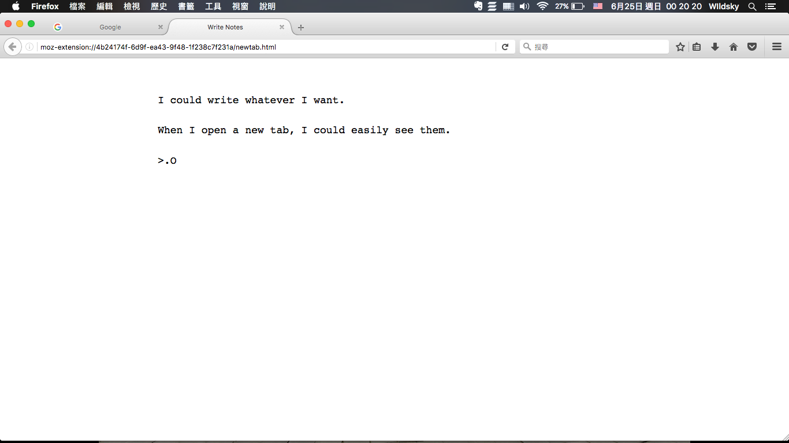

# Tab Notes
Open new tab and write anything.

## Features:

* **Easy-to-use**: Just open new tab, and write down thoughts.
* **Auto-save**: No worries about saving things when writing.
* **Theme**: Support light and dark theme.
* **Lightweight and fast**
* **Multi-notes**
* **Browser-action with shortcut**: You could use it without changing your current new tab page
* **Support Rich Text Functions**: You are able to bold, italic and underline your texts
* **Print and Download**: You are able to print the text that you typed, as well as download the text as HTML
* Open-source

## Shortcuts

- `Ctrl/Cmd + Y`: To open the browser-action tab notes.

## Download

Tab Notes is available to the following browsers:
* [Firefox](https://addons.mozilla.org/firefox/addon/tab-notes/)
* [Chrome](https://chrome.google.com/webstore/detail/tab-notes/obnnegakmgonaiplaobihpmcjhlceeic)

## Screenshot

